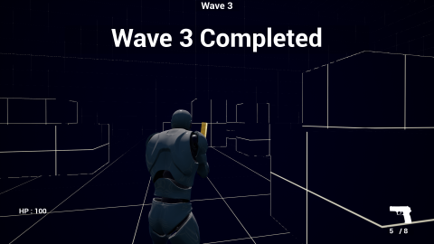

# Competition game

 

Created for the search for a star competition, Spy League Training is a single or local two player multiplayer game where the player/s must survive waves of enemies for as long as possible.
This is an Unreal Engine 4 project implemented with Blueprint visual scripting and C++.

This repository contains the Unreal Engine 4 project and game source code.
